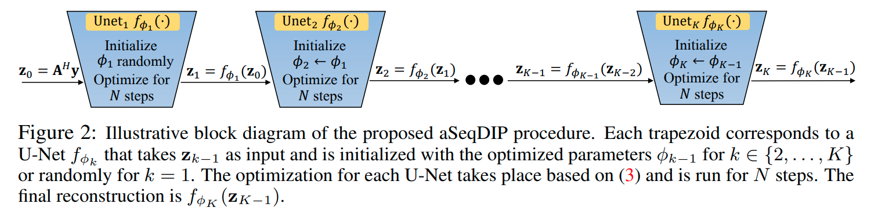
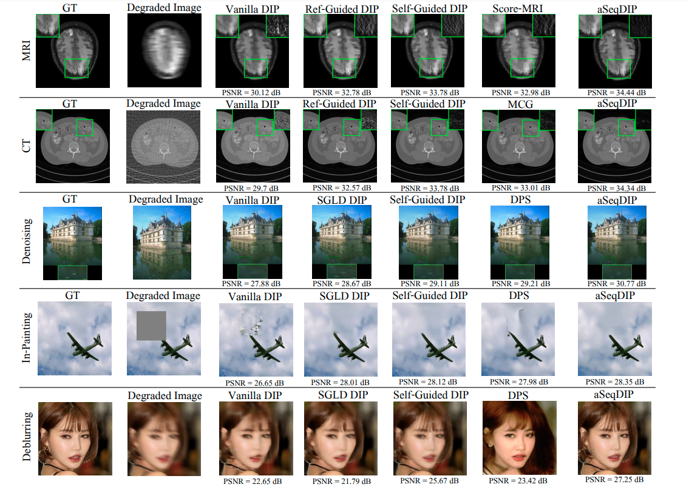

# Image Reconstruction Via Autoencoding Sequential Deep Image Prior (aSeqDIP)

## NeurIPS 2024

**Authors**: Ismail R. Alkhouri*, Shijun Liang*, Evan Bell, Qing Qu, Rongrong Wang, and Saiprasad Ravishankar. 


### Abstract: 
Recently, Deep Image Prior (DIP) has emerged as an effective unsupervised one-shot learner, delivering competitive results across various image recovery problems. This method only requires the noisy measurements and a forward operator, relying solely on deep networks initialized with random noise to learn and restore the structure of the data. However, DIP is notorious for its vulnerability to overfitting due to the overparameterization of the network. Building upon insights into the impact of the DIP input and drawing inspiration from the gradual denoising process in cutting-edge diffusion models, we introduce the Autoencoding Sequential DIP (aSeqDIP) for image reconstruction by progressively denoising and reconstructing the image through a sequential optimization of multiple network architectures. This is achieved using an input-adaptive DIP objective, combined with an autoencoding regularization term. Our approach differs from the Vanilla DIP by not relying on a single-step denoising process. Compared to diffusion models, our method does not require pre-training and outperforms DIP methods in mitigating noise overfitting while maintaining the same number of parameter updates as Vanilla DIP. Through extensive experiments, we validate the effectiveness of our method in various imaging reconstruction tasks, such as MRI and CT reconstruction, as well as in image restoration tasks like image denoising, inpainting, and brown non-linear non-uniform deblurring.


## aSeqDIP Illustrative Diagram:


## Results:


### For MRI: 
Download the [fastMRI](https://github.com/microsoft/fastmri-plus/tree/main) dataset. 

### For sparse view CT: 
Download the [AAPM](https://www.aapm.org/grandchallenge/lowdosect/) dataset.

### For image restoration: 
Setup the [DPS](https://github.com/DPS2022/diffusion-posterior-sampling) code for the forward models. 

## Blur Operator Source

In `Aseq_DIP_Deblurring.py`, the class `BlurOperator (torch.nn.Module)` is sourced from the following open-source repository:

https://github.com/VinAIResearch/blur-kernel-space-exploring/tree/main

The blur operator is used to construct the forward degradation model in the deblurring task.


### To cite our paper, use the following: 
```bibtex
@inproceedings{alkhouriNeuIPS24,
author    = {Alkhouri, Ismail and Linag, Shijun and Bell, Evan and Qu, Qing and Wang, Rongrong and Ravishankar, Saiprasad },
  title     = {Image Reconstruction Via Autoencoding Sequential Deep Image Prior},
  booktitle   = {Advances in neural information processing systems (NeurIPS)},
  year      = {2024}
}
